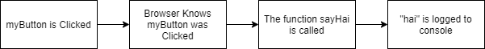

# Event Handler Crash Course

## Basic Structure of Events


#### For example
```js
let myButton = document.getElementById("myButton");
let sayHai = function(e) {
    console.log("hai");
}
myButton.AddEventListener('click', sayHai);
```


## Commonly Used Events
Here are a couple commonly used events:
- `click`: When a user clicks the element
- `load`: When the object has finished loading
- `mouseover`: When the mouse hovers over the element
- `input`: When the contents of an input element is changed (ie: a checkbox is clicked or text is changed)

For all event types, see the [documentation](https://developer.mozilla.org/en-US/docs/Web/Events)

## Adding Event Handlers
Use the [`addEventListener`](https://developer.mozilla.org/en-US/docs/Web/API/EventTarget/addEventListener) method of html elements

For example:
```js
let myDiv = document.querySelector('#myDiv');
myDiv.addEventListener('load', myFunct);
```

## Removing Event Handlers
Use the [`removeEventListener`](https://developer.mozilla.org/en-US/docs/Web/API/EventTarget/removeEventListener) method of html elements

For example:
```js
let myDiv = document.querySelector('#myDiv');
myDiv.removeEventListener('load', myFunct);
```

## [Event Objects](https://developer.mozilla.org/en-US/docs/Web/API/Event)


#### Just the Important Stuff:
- `target`: The HTML element object that this event happened for
- `type`: What kind of event happened
- `timestamp`: When the event happened

#### How to Get Event Objects
Going back the first example:
```js
let myButton = document.getElementById("myButton");
let sayHai = function(e) {
    console.log("hai");
}
myButton.AddEventListener('click', sayHai);
```
We can if we add an argument to our function, the first arguement (usually called 'e') will be passed the event object
```js
let myButton = document.getElementById("myButton");
let sayHai = function(myEventObject) {
    console.log("hai");
    console.log($`Event Object: {myEventObject}`);
}
myButton.AddEventListener('click', sayHai);
```

## Examples

#### Easy Examples
- [Example 01](./example-problems/example-01/index.html)

#### Advanced Examples
- [Example 1](./example-problems/example-1/index.html)
- [Example 2](./example-problems/example-2/index.html)
- [Example 3](./example-problems/example-3/index.html)
- [Example 4](./example-problems/example-4/index.html)
